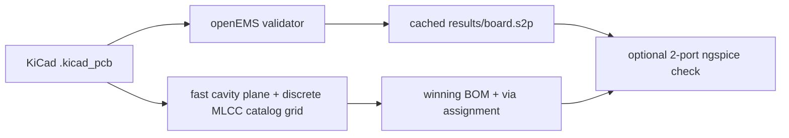

# PDN Co-Simulation

Automated PDN pipeline: layout → EM extract → SPICE → optimizer → report.

**Status:** Phase 1–5 are on this tree. openEMS is the **validator** (mesh/ports), not the inner-loop extractor. `--spice` and `--optimize` do not launch FDTD.

## Problem

A digital IC’s power pins need a low impedance from DC through the switching band. If |Z(f)| at the pin is too high, a current step becomes voltage droop — bounce, timing margin, sometimes EMI. “More capacitance” is the wrong lever: the number is the plane pair, via spreading, VRM inductance, and MLCC ESR/ESL together, and it moves with frequency.

SI/PI teams usually extract the power/ground cavity in HFSS or SIwave, drop the Touchstone into Cadence (or another SPICE), then iterate decoupling until |Z| and time-domain droop look acceptable. That loop is slow when a 3D field solve sits inside every capacitor guess.

## Endura

This repo continues PDN simulation work started at Endura. The commercial stack for that job is HFSS/SIwave plus Cadence; here the same layout → extract → SPICE → decap-search thread is scripted on an open solver stack so the loop is one command, not a GUI session.

## Architecture

openEMS is the **validator**, not the inner-loop extractor. A 100 kHz–1 GHz PDN sweep is an awkward FDTD problem, so `--optimize` (and `--spice`) must not launch it. `--board` may run FDTD once to refresh a cached Touchstone when the layout changes.



- **Validator:** mesh ports, write `results/board.s2p`. Phase 1 also checks a parallel-plate coupon against a closed-form line (|S| error &lt; 5% in the excite band).
- **Inner loop:** 1-cavity spreading plane + 0–3 of each catalog MLCC assigned to VCC vias. Not FDTD, not a 64× ngspice sweep.
- **Optional check:** ngspice re-sims the winner on the 2-port `.s2p` (all caps at extracted port 2). That check cannot see other vias and does not re-rank the BOM.

`--board`, `--spice`, and `--optimize` are mutually exclusive.

## How to run

From the clone:

```bash
source .venv/bin/activate
python run_pipeline.py                              # Phase 1 plate (no FDTD unless you regenerate .s2p)
python run_pipeline.py --board boards/pdn_test.kicad_pcb
python run_pipeline.py --spice results/board.s2p
python run_pipeline.py --optimize results/board.s2p  # does not launch FDTD
pytest
```

The project venv already has NumPy/SciPy and the CSXCAD/openEMS bindings (built against `~/opt/openEMS`).

`pytest` always checks closed-form plate Z0 and the KiCad reader. The FDTD vs analytical |S| gate, board power-conservation smoke, board `.s2p` netlists, ngspice transients, and optimizer 2-port checks **skip** when `ngspice` or the relevant `.s2p` is missing — same as now.

On macOS, SPICE needs:

```bash
brew install ngspice
```

The pipeline shells out to the `ngspice` binary; libngspice / PySpice is not required at runtime.

### `python run_pipeline.py` — Phase 1 plate

Default entry: a **solver-validation geometry**, not a PDN. A realistic power/ground pair is wide and thin (Z0 ~ 1 Ω); S-parameters against 50 Ω are poorly conditioned. Defaults are a thick, narrower plate (10 mm × 1.6 mm FR-4, Z0 ~ 28 Ω) so FDTD vs the analytical transmission-line formula is well-conditioned. The mesh uses PMC sidewalls (no-fringing, matching the Z0 formula) and stops the plates at the lumped ports so the guide does not continue into PML.

This command does **not** auto-run FDTD. `pytest` always checks closed-form Z0. When `results/parallel_plate.s2p` exists, it also requires |S| error &lt; **5%** in the excite band (0.5–2.5 GHz). To regenerate that Touchstone:

```bash
python -c "from pathlib import Path; from em_extraction import ParallelPlateGeometry; from em_extraction.openems_mesh import extract_sparams; extract_sparams(ParallelPlateGeometry.validation_plate(), sim_dir=Path('results/openems_parallel_plate'), output_s2p=Path('results/parallel_plate.s2p'))"
```

### `python run_pipeline.py --board boards/pdn_test.kicad_pcb` — Phase 2 extract

Reads via/pad coordinates and stackup from the `.kicad_pcb` s-expression (no manual xy; `pcbnew` is not imported). Meshes the inner VCC/GND plane pair and writes `results/board.s2p` (gitignored). Port 1 is footprint `U1` on net `VCC`; port 2 is the first VCC via (`--decap-index N` selects another).

After a layout edit in KiCad, save and rerun this command — no mesh edits. Net/footprint conventions are in `boards/README.md`.

`pytest` unit-tests the reader against the checked-in board (no solver). The board FDTD smoke (`|S11|²+|S21|² ≈ 1` in the excite band) runs when `results/board.s2p` exists. The Phase 1 |S| gate is unchanged.

### `python run_pipeline.py --spice results/board.s2p` — Phase 3 SPICE

Does **not** run openEMS. Reads the cached Touchstone, fits a lumped pi, and runs ngspice. If `results/board.s2p` is missing, the command tells you to run `--board` first; `--spice` will not refresh it.

Writes `results/droop.png` (IC-pin voltage vs time), `results/z_pdn.png` (|Z(f)| of the same circuit), and a short numeric summary (peak droop, settling). Port 1 = IC pin, port 2 = decap site. VRM, MLCC ESR/ESL, and the lumped 2-port fit are in `spice_models/README.md`.

`pytest` unit-tests netlist generation from the analytical plate (always) and from `results/board.s2p` when that file exists. The transient test skips if ngspice is missing; if ngspice is present it asserts finite voltages and a measurable load-step droop (not a flat rail).

### `python run_pipeline.py --optimize results/board.s2p` — Phase 4/5 search

Does **not** launch FDTD. Inner loop is the fast cavity plane plus a discrete MLCC catalog grid (0–3 of each of three Murata parts, assigned across VCC vias on `boards/pdn_test.kicad_pcb`).

- **Missing board** (`boards/pdn_test.kicad_pcb`) is an error.
- **Missing `.s2p`** skips the 2-port ngspice check but still searches and plots the plane. Run `--board` first if you want that check.
- Missing ngspice skips the same 2-port check.

The 2-port check (when both ngspice and `.s2p` exist) stuffs every winning MLCC at extracted port 2. It cannot see other vias and does not pick the winner. Artifacts are listed under Results.

`pytest` skips Phase 4 ngspice / `.s2p` tests when those are missing. The Phase 1 |S| gate is unchanged.

## Results

Plots are gitignored. Run `--optimize` (venv on) to write them under `results/`.

- **`z_opt.png`** — fast-plane |Z(f)| before (empty sites) vs after (winning via assignment). Log-log, Z_target line. Not 2-port SPICE.
- **`pareto.png`** — peak |Z| vs BOM $ for each count-vector after placement. Feasible points (cost ≤ budget) highlighted; winner marked. Fast-plane search, not FDTD.
- **`z_spatial.png`** — fast-plane peak |Z| vs xy, IC and stuffed/empty VCC vias overlaid. Not openEMS.
- **`bom_cost.txt`** — part, qty, unit $, ext $, budget / feasible flag.
- **`z_opt_2port.png`** / **`droop_opt.png`** — 2-port check only, and only if ngspice and `results/board.s2p` are both present. All caps at the extracted site.

Phase 3 (`--spice`) still writes `droop.png` and `z_pdn.png` from the cached `.s2p` alone.

## Honest limits

- A 2-port `.s2p` cannot move caps. Placement lives on the plane model; the SPICE check parks every MLCC at port 2.
- The plane is 1-cavity spreading (parallel-plate C plus ln spreading L to each via), not a full cavity-mode series.
- 50 mΩ to 1 GHz is **not** claimed. `DEFAULT_VRM.l_out_h` = 2 nH → ωL ≈ 12.6 Ω at 1 GHz (≈ 1.26 Ω at 100 MHz). The high-frequency floor is VRM inductance plus ESL, not “need more 22 µF”.
- `pdn_test` is a 30 mm × 20 mm 4-layer coupon, not a product PDN.
- The search constraint is BOM cost (default $0.50), not Z_target. The 50 mΩ line on the plots is a reference, the same one as `z_pdn.png`. Do not read the plots as “we hit 50 mΩ”.

## What I’d do with more time

- N-port extract as the validator, so a SPICE check can see more than one via.
- VNA on a fabbed coupon, compared to the same cached Touchstone / plane |Z|.
- More catalog SKUs (values and cases), still discrete, still cost-capped.

No extra modules are stubbed in this tree for those.

## Stack

- Python 3.11+ (NumPy, SciPy, Matplotlib, pandas, pytest). PySpice is in `requirements.txt`; the pipeline talks to the `ngspice` binary directly.
- KiCad 8 — Phase 2 board files. The pipeline parses `.kicad_pcb` s-expressions in the project venv. **Do not import `pcbnew`** (it only exists in KiCad’s bundled Python).
- openEMS / CSXCAD — validator (Phase 1 plate + Phase 2 `results/board.s2p`), not the SPICE or optimizer inner loop.
- ngspice — Phase 3 transient / AC and the optional Phase 4 2-port check (`brew install ngspice`).

## System dependencies (macOS, Apple Silicon)

These are **not** pip packages. On a machine where the project is already set up they are installed:

| Piece | Where |
| --- | --- |
| Homebrew | `/opt/homebrew` |
| openEMS C++ | `~/opt/openEMS` (`openEMS --help` via `~/opt/openEMS/bin/openEMS`) |
| Python bindings | project `.venv` (not a pip package) |
| ngspice | `/opt/homebrew/bin/ngspice` (`brew install ngspice`) |

Do not rebuild openEMS unless this is a **new machine**. Then:

```bash
eval "$(/opt/homebrew/bin/brew shellenv)"
brew install cmake pkg-config boost hdf5 cgal vtk
git clone --recursive https://github.com/thliebig/openEMS-Project.git ~/src/openEMS-Project
python3.13 -m venv .venv
source .venv/bin/activate
pip install -U pip setuptools wheel cython
pip install -r requirements.txt h5py
export CMAKE_PREFIX_PATH="$(brew --prefix)"
cd ~/src/openEMS-Project
./update_openEMS.sh ~/opt/openEMS --python --disable-GUI
```

`--disable-GUI` skips AppCSXCAD (needs extra Qt). TinyXML is downloaded by the script; Homebrew no longer ships it.

- **KiCad 8** — optional GUI to edit `boards/pdn_test.kicad_pcb`. The pipeline does not call `pcbnew`.
- **ngspice** — headless `ngspice -b` for Phase 3 and the optional optimizer check; `--spice` / `--optimize` do not launch FDTD.
